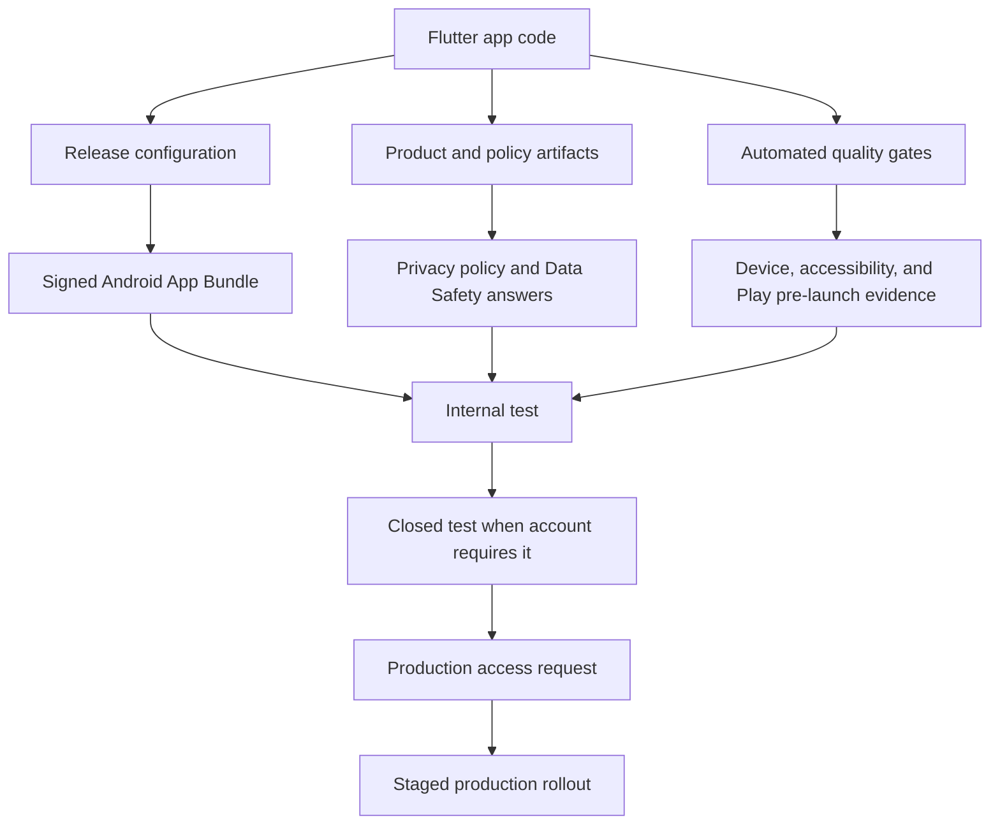
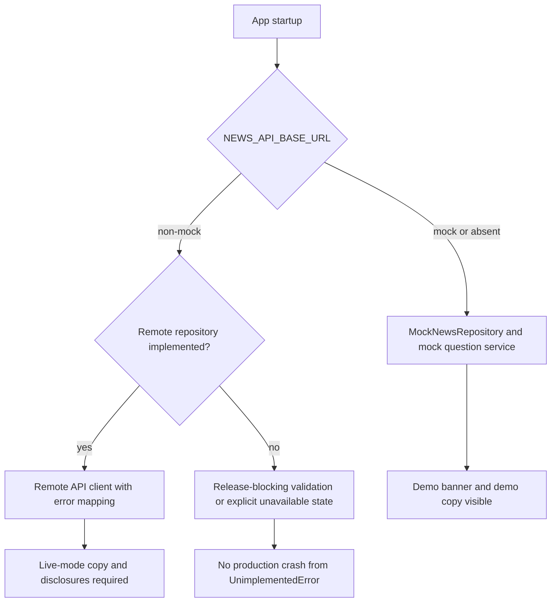

# feat: Prepare VeriMundi for Google Play production release

## Summary

Prepare the existing Flutter MVP for a production Google Play launch as an honest demo/MVP: fictional content remains explicit, release builds are signed and policy-ready, privacy disclosures match app behavior, and every core journey is covered by automated and device-based verification.

---

## Problem Frame

VeriMundi is already a functional Flutter MVP with mock global-news content, Riverpod dependency injection, GoRouter navigation, Drift persistence, and a small test suite. It is not yet Play Store-ready: Android release signing still uses the debug key, release metadata carries template defaults, the remote repository path is intentionally unimplemented, privacy and Data Safety artifacts are not present, and the current quality coverage does not yet prove accessibility, adaptive layouts, crash behavior, store-listing truthfulness, or closed-test readiness.

The product spec keeps live news ingestion, real GenAI provider calls, user accounts, push notifications, and credibility scoring outside MVP scope. This plan therefore raises the current mock-data app to deployable quality without pretending it is a live news product.

---

## Requirements

**Release Engineering**

- R1. The production build must be a signed Android App Bundle with release credentials outside source control and Play App Signing-ready configuration.
- R2. The app must target the current Google Play mobile-app submission floor, at least Android 15/API 35 as documented for new apps and updates starting August 31, 2025.

**Product Truthfulness and Policy**

- R3. Store-facing product language must clearly state that the app uses fictional demo content and must not imply live news coverage, real source retrieval, or real AI analysis.
- R4. The app must have a privacy policy, Data Safety inventory, and third-party SDK disclosure that match the actual permissions, local persistence, network behavior, and telemetry behavior.
- R5. The client must preserve the AI safety rule that no commercial GenAI provider secret or direct provider call ships in the Flutter app.

**Runtime Safety and Quality**

- R6. Misconfigured release builds must fail visibly or stay in explicit mock mode; setting a non-mock backend must not leave users with `UnimplementedError` crashes.
- R7. Core journeys must remain usable across phone, tablet, foldable, portrait, landscape, light theme, dark theme, text scaling, and screen-reader access.
- R8. Saved-story persistence must remain correct across app restarts, updates, empty states, and removal flows.
- R9. Release quality gates must include unit, widget, integration, accessibility, adaptive-layout, Android release-build, and Play pre-launch verification.

**Play Console Rollout**

- R10. Play Console rollout must include internal testing, closed testing where account status requires it, production-readiness evidence, and a staged release path.

---

## Scope Boundaries

### In Scope

- Android production release configuration for Google Play distribution.
- Product and settings copy that makes demo content, mock AI, and non-live behavior unambiguous.
- Privacy policy and Data Safety preparation for the current app and any added telemetry SDKs.
- Architecture hardening around mock mode, remote mode, AI safety, error handling, and persistence.
- Test coverage and release QA sufficient for a production-store submission.
- Store listing assets and Play Console rollout documentation.

### Deferred to Follow-Up Work

- Live multilingual news ingestion, article clustering, translation, licensed provider integrations, account sync, notifications, and real GenAI orchestration remain future-product work.
- A backend implementation for the REST contract remains deferred unless the release scope changes from demo/MVP to live service.
- Editorial credibility methodology remains deferred because the product spec explicitly lists it as a non-goal.

### Outside This Release

- Monetization, ads, in-app purchases, and user-generated content.
- Publishing to app stores outside Google Play.
- Rebranding the product or changing the core product strategy.

---

## Key Technical Decisions

- KTD1. Release as a transparent demo/MVP, not a live news app: The README and product spec both define current content as fictional mock data, so Play Store copy and in-app surfaces must reinforce that instead of expanding scope into live ingestion.
- KTD2. Keep `NEWS_API_BASE_URL=mock` as the safe production default: Mock mode prevents accidental network or AI-provider behavior, while release checks can block non-mock builds until a real `RemoteNewsRepository` exists.
- KTD3. Treat privacy disclosure as a code-driven inventory: Google Play requires every published app to complete Data Safety and provide a privacy policy even when no user data is collected, and the form must include third-party SDK data practices.
- KTD4. Add release signing through Gradle properties and ignored keystore files: Flutter's Android release guidance requires a signed bundle for Play publishing and warns that keystores must not be checked into source control.
- KTD5. Prefer a staged Play rollout after internal and closed testing: Play Console guidance for new personal accounts requires a closed test with at least 12 opted-in testers for 14 continuous days before production access, and staged rollout reduces review and device-fragmentation risk.
- KTD6. Make observability policy-aware: Crash reporting is valuable for production quality, but any SDK that collects identifiers or diagnostics must be reflected in the privacy policy and Data Safety form before it ships.

---

## High-Level Technical Design

### Release Readiness Flow

### Runtime Mode Guard

---

## Implementation Units

### U1. Release Identity and Product Truthfulness

- **Goal:** Align app identity, in-app copy, README, store listing draft, and settings with a Play Store-ready demo/MVP.
- **Requirements:** R3, R5, R10
- **Dependencies:** None
- **Files:** `README.md`, `docs/product_spec.md`, `docs/play_store_listing.md`, `lib/core/constants/app_constants.dart`, `lib/features/settings/presentation/settings_screen.dart`, `test/features/verimundi_widget_test.dart`
- **Approach:** Replace template or ambiguous release language with explicit demo/MVP language. Add a store-listing draft with short description, full description, support contact placeholders, screenshot checklist, and content disclaimers that match the app's actual fictional catalog. Keep AI transparency language close to the settings surface and story detail surfaces.
- **Patterns to follow:** Existing `DemoBanner`, `AppConstants.demoBanner`, and `docs/ai_safety.md`.
- **Test scenarios:**
  - Pump the app and verify the demo banner appears on the World and Story Detail journeys with copy that states the stories are fictional.
  - Open Settings and verify data mode, AI transparency, and app version/status copy match the release posture.
  - Search the store-listing draft for prohibited overclaims such as live news, real-time alerts, real source retrieval, or real AI provider operation.
- **Verification:** A reviewer can compare app UI, README, and store-listing draft and find no contradiction about mock data, fictional stories, or mock AI behavior.

### U2. Android Release Signing, Versioning, and Bundle Configuration

- **Goal:** Replace debug signing with Play-ready release signing and deterministic versioning.
- **Requirements:** R1, R2, R10
- **Dependencies:** U1
- **Files:** `android/app/build.gradle.kts`, `android/gradle.properties`, `.gitignore`, `docs/release/android_release.md`, `pubspec.yaml`
- **Approach:** Configure release signing from local Gradle properties or a local key-properties file that is ignored by git. Remove template TODOs, set the display label to `VeriMundi`, document versionCode/versionName policy, and verify the Flutter-generated target SDK meets or exceeds the Play floor before release. Keep the app bundle as the canonical Play artifact.
- **Patterns to follow:** Existing Kotlin Gradle DSL in `android/app/build.gradle.kts` and Flutter's Android release flow.
- **Test scenarios:**
  - Build configuration resolves when local signing properties are present and does not reference the debug signing config for release.
  - Build configuration fails with a clear message when release signing is requested without required local signing properties.
  - Manifest/application metadata resolves to `VeriMundi` and the package ID remains stable.
  - Version increments are documented so a new release cannot reuse an older Play versionCode.
- **Verification:** A signed release `.aab` can be produced locally or in CI from non-committed signing material, and no keystore or signing password appears in git.

### U3. Privacy, Permissions, Data Safety, and SDK Inventory

- **Goal:** Produce policy artifacts that match the binary and release behavior.
- **Requirements:** R4, R5, R10
- **Dependencies:** U1, U2
- **Files:** `docs/privacy_policy.md`, `docs/play_data_safety.md`, `docs/release/android_release.md`, `android/app/src/main/AndroidManifest.xml`, `pubspec.yaml`
- **Approach:** Inventory permissions, local Drift persistence, asset-only mock content, Dio network capability, sqlite/path-provider behavior, and any telemetry SDK selected in U6. Draft a privacy policy and Data Safety worksheet from that inventory. Keep the manifest permission-minimal and avoid adding sensitive permissions unless a product requirement demands them.
- **Patterns to follow:** Current manifest has no dangerous runtime permissions; current saved stories are local snapshots in `AppDatabase`.
- **Test scenarios:**
  - Static audit verifies manifest permissions are limited to the permissions required by the release behavior.
  - Data Safety worksheet lists each dependency category and whether it collects, shares, or stores user data.
  - Privacy policy states local saved-story behavior and demo/mock data posture consistently with Settings and README.
  - If telemetry is added, its collected diagnostics and identifiers are reflected in both the privacy policy and Data Safety worksheet.
- **Verification:** Play Console Data Safety answers can be filled from `docs/play_data_safety.md` without guessing, and a reviewer can trace every disclosure back to code or dependency behavior.

### U4. Runtime Mode and Data-Layer Hardening

- **Goal:** Prevent release crashes or misleading behavior when runtime configuration changes.
- **Requirements:** R5, R6, R8
- **Dependencies:** U1, U3
- **Files:** `lib/core/network/api_client.dart`, `lib/shared/providers/app_providers.dart`, `lib/features/stories/data/mock_news_repository.dart`, `lib/features/stories/domain/news_repository.dart`, `lib/shared/widgets/async_value_view.dart`, `test/features/mock_repository_test.dart`, `test/features/stories_domain_test.dart`
- **Execution note:** Add characterization coverage around current mock-mode behavior before changing provider selection.
- **Approach:** Introduce an explicit app data-mode abstraction so mock mode is intentional and non-mock mode is either fully implemented or blocked with a user-safe unavailable state. Avoid shipping a path where `RemoteNewsRepository` throws `UnimplementedError` in production. Keep commercial GenAI calls out of the client.
- **Patterns to follow:** Existing provider-based repository selection in `app_providers.dart` and mock catalog loading in `MockNewsRepository`.
- **Test scenarios:**
  - With no dart define, providers select mock repositories and all feeds load from local assets.
  - With `NEWS_API_BASE_URL=mock`, behavior is identical to the default.
  - With a non-mock URL and no remote implementation, the app exposes a controlled unavailable state or release validation fails before distribution.
  - Mock AI insufficient-evidence behavior still returns transparent copy and zero confidence.
  - Saved-story IDs merge into story lists after save/remove operations without stale UI state.
- **Verification:** There is no production-reachable `UnimplementedError` path from provider selection, and the AI safety client-side rule remains enforced.

### U5. Adaptive UX, Accessibility, and Navigation Quality

- **Goal:** Raise the user experience to Play core-quality expectations across form factors and accessibility settings.
- **Requirements:** R7, R9
- **Dependencies:** U1, U4
- **Files:** `lib/app/router.dart`, `lib/features/world/presentation/world_screen.dart`, `lib/features/world/presentation/world_map_view.dart`, `lib/features/stories/presentation/story_detail_screen.dart`, `lib/shared/widgets/story_card.dart`, `lib/shared/widgets/filter_bar.dart`, `test/features/verimundi_widget_test.dart`, `test/features/accessibility_test.dart`
- **Approach:** Audit all primary journeys for text scaling, semantic labels, focus order, back navigation, refresh behavior, empty states, loading states, and landscape/tablet/foldable layouts. Improve map marker semantics and avoid fixed-width widgets that break at large text sizes or narrow widths.
- **Patterns to follow:** Existing Material 3 theme, `AsyncValueView`, `StoryCard`, and GoRouter shell navigation.
- **Test scenarios:**
  - World, Underreported, Positive, Saved, Settings, and Story Detail render without overflow at large text scale.
  - Screen-reader semantics expose meaningful labels for story cards, save buttons, map markers, severity pills, and source actions.
  - Android back navigation from Story Detail returns to the previous tab state rather than resetting the app.
  - Empty saved stories state explains how to save a story and does not render a blank list.
  - Portrait, landscape, tablet-width, and foldable-width widget tests render the core World and Story Detail journeys without clipped text.
- **Verification:** Core journeys satisfy Android core-quality checks for navigation, visual quality, orientation changes, theme support, and state preservation.

### U6. Observability and Production Diagnostics

- **Goal:** Add enough diagnostics to detect production crashes without creating undisclosed data practices.
- **Requirements:** R4, R6, R9, R10
- **Dependencies:** U3, U4
- **Files:** `lib/app/bootstrap.dart`, `lib/main.dart`, `pubspec.yaml`, `docs/play_data_safety.md`, `docs/privacy_policy.md`, `test/features/bootstrap_error_handling_test.dart`
- **Approach:** Centralize Flutter framework errors, uncaught zone errors, and provider-load failures in bootstrap. Decide whether to add Firebase Crashlytics or another crash-reporting SDK only if U3 disclosures are updated in the same change. For a no-telemetry release, document Play pre-launch reports and tester feedback as the first production-quality signal.
- **Patterns to follow:** Existing `bootstrap.dart` entry point and Riverpod provider boundaries.
- **Test scenarios:**
  - A simulated Flutter error is captured by the bootstrap error boundary and does not silently disappear.
  - A simulated provider failure renders an actionable error state through `AsyncValueView`.
  - If crash reporting is enabled, test-mode initialization avoids network submission and the privacy/Data Safety docs disclose the SDK.
  - If crash reporting is not enabled, release docs require Play pre-launch reports and closed-test feedback review before staged production.
- **Verification:** The release has an explicit diagnostics strategy, and that strategy is reflected in policy docs and rollout gates.

### U7. Automated Test Matrix and CI-Ready Quality Gates

- **Goal:** Expand coverage from MVP smoke tests to release-blocking quality gates.
- **Requirements:** R7, R8, R9, R10
- **Dependencies:** U4, U5, U6
- **Files:** `test/features/verimundi_widget_test.dart`, `test/features/mock_repository_test.dart`, `test/features/saved_repository_test.dart`, `test/features/stories_domain_test.dart`, `test/features/ai_services_test.dart`, `integration_test/app_journeys_test.dart`, `.github/workflows/flutter.yml`, `docs/release/android_release.md`
- **Approach:** Add integration tests for the main user journeys, strengthen saved-story persistence tests, add accessibility/adaptive widget tests, and create CI workflow gates for formatting, analysis, tests, code generation drift, and Android release bundle build. Keep test cases grounded in product journeys rather than implementation trivia.
- **Patterns to follow:** Existing `test/test_helpers.dart`, in-memory Drift database overrides, and widget smoke test style.
- **Test scenarios:**
  - World dashboard loads, filters, changes feed mode, opens Story Detail, asks a mock question, and returns via back navigation.
  - Saved-story flow saves from a card, appears in Saved, survives repository reload, and can be removed.
  - Story filtering covers region, severity, tone, verification, category, local coverage, and date boundaries.
  - AI services reject certainty prompts and insufficient-evidence stories with transparent responses.
  - CI detects generated-code drift after Freezed/JSON/Drift model changes.
  - Release bundle build succeeds only after signing configuration and policy docs are in place.
- **Verification:** A clean branch cannot be considered release-ready unless the automated gates and integration journey tests pass.

### U8. Play Console Rollout, Store Assets, and Release Evidence

- **Goal:** Prepare the operational package needed to submit, test, and stage the release in Play Console.
- **Requirements:** R1, R2, R3, R4, R9, R10
- **Dependencies:** U1, U2, U3, U5, U6, U7
- **Files:** `docs/release/play_console_checklist.md`, `docs/play_store_listing.md`, `docs/release/android_release.md`, `README.md`
- **Approach:** Document Play Console setup, app category, contact email, privacy policy URL, Data Safety answers, content rating, target audience, store assets, screenshot scenarios, internal testing, closed testing, pre-launch report review, production-access answers, and staged rollout criteria.
- **Patterns to follow:** Existing README feature list and product-spec main journeys.
- **Test scenarios:**
  - Checklist includes internal testing, closed testing, production access, pre-launch report review, and staged rollout gates.
  - Screenshot list covers World dashboard, Underreported feed, Positive feed, Story Detail, Saved stories, and Settings with demo content visible where appropriate.
  - Store listing copy matches in-app behavior and does not claim live news ingestion or real AI analysis.
  - Release evidence template records devices, Android versions, form factors, accessibility settings, and tester feedback themes.
- **Verification:** The Play Console submission can be assembled from repo artifacts plus account-specific Play Console inputs, and release evidence is sufficient to answer production-readiness questions.

---

## System-Wide Impact

- **Product trust:** The release must be honest about fictional data because a news-adjacent app can mislead users if mock content looks real.
- **Privacy posture:** Today the app appears low-risk because it uses local mock assets and local saved-story persistence, but adding telemetry or a backend changes Data Safety and privacy-policy answers.
- **Release safety:** Android release signing, target SDK, app bundle generation, versioning, and Play Console declarations become hard gates rather than optional cleanup.
- **Architecture:** Provider-based dependency injection remains the right boundary, but runtime mode must be explicit so configuration cannot route users into an unfinished remote repository.
- **QA scope:** Existing unit and widget tests are useful but insufficient for Play launch because they do not cover adaptive layouts, accessibility, release builds, closed-test feedback, or pre-launch reports.

---

## Risks & Dependencies

- **Policy drift:** Google Play requirements change. Mitigation: re-check Play policy pages immediately before final submission and record the check date in `docs/release/play_console_checklist.md`.
- **Privacy mismatch:** Data Safety answers can drift from SDK behavior. Mitigation: treat dependency changes and new permissions as release-blocking until `docs/play_data_safety.md` and `docs/privacy_policy.md` are updated.
- **Demo-content rejection risk:** A news-like app with fictional stories can be perceived as misleading. Mitigation: keep demo labels visible in-app, in screenshots, and in listing copy.
- **Signing-key handling:** Lost upload keys or committed keystores create operational and security risk. Mitigation: store signing files outside git, document ownership, and use Play App Signing.
- **Device fragmentation:** Map, card, and detail layouts may break on tablets, foldables, landscape, or large text. Mitigation: add adaptive widget tests and run Play pre-launch reports before production.
- **Telemetry tradeoff:** Crash reporting improves quality but may introduce disclosure obligations. Mitigation: decide telemetry in U6 only alongside privacy and Data Safety updates.

---

## Documentation and Operational Notes

- `docs/release/android_release.md` should become the canonical local release runbook.
- `docs/release/play_console_checklist.md` should separate repo-controlled artifacts from account-specific Play Console fields.
- `docs/play_store_listing.md` should be reviewed against actual screenshots before submission.
- `docs/privacy_policy.md` needs a public URL before production submission.
- README should keep development setup separate from release setup so local contributors do not need signing material.

---

## Sources and Research

- Repo product intent: `README.md`, `docs/product_spec.md`, `docs/api_contract.md`, `docs/ai_safety.md`.
- Repo release blockers: `android/app/build.gradle.kts`, `android/app/src/main/AndroidManifest.xml`, `pubspec.yaml`.
- Repo architecture patterns: `lib/shared/providers/app_providers.dart`, `lib/features/stories/data/mock_news_repository.dart`, `lib/core/database/app_database.dart`, `test/features/verimundi_widget_test.dart`.
- Flutter Android release guidance: [Build and release an Android app](https://docs.flutter.dev/deployment/android).
- Google Play target API guidance: [Meet Google Play's target API level requirement](https://developer.android.com/google/play/requirements/target-sdk) and [Target API level requirements for Google Play apps](https://support.google.com/googleplay/android-developer/answer/11926878).
- Google Play Data Safety guidance: [Provide information for Google Play's Data safety section](https://support.google.com/googleplay/android-developer/answer/10787469).
- Google Play setup guidance: [Create and set up your app](https://support.google.com/googleplay/android-developer/answer/9859152).
- Google Play testing guidance: [App testing requirements for new personal developer accounts](https://support.google.com/googleplay/android-developer/answer/14151465).
- Android quality guidance: [Core app quality guidelines](https://developer.android.com/docs/quality-guidelines/core-app-quality).
